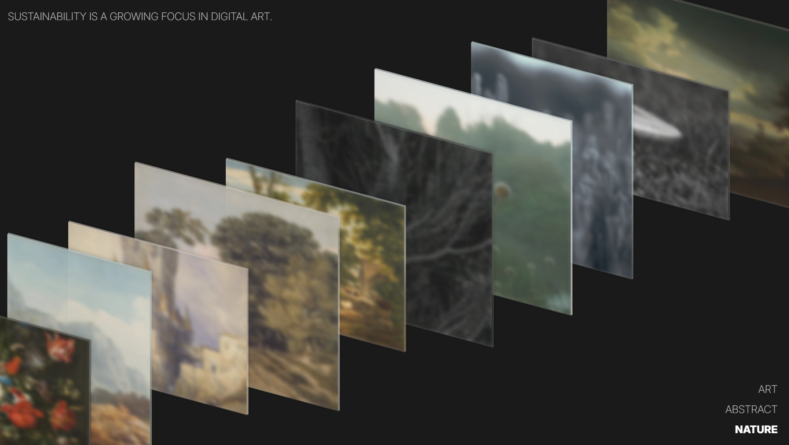
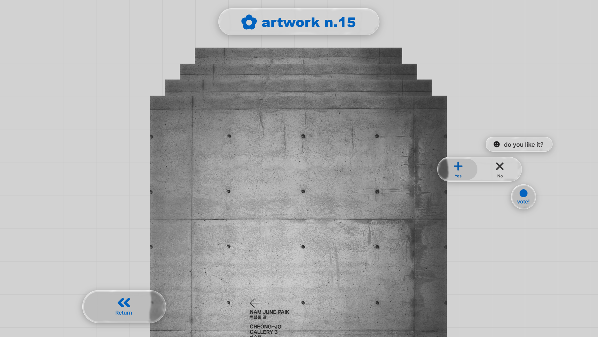

# Interactive 3D Image Gallery

A web app that displays images in a 3D layout using React and CSS. Features include animated filtering, detailed views with glassmorphism effects, and a basic Flask backend for authentication and voting. 

**Current Status:**  Fully functional and deployed on AWS EC2.

## Overview
The application is architected with a React frontend that handles all the user interaction and complex animations, and a lightweight Flask backend that serves data and handles API requests for login and voting.

Features
*   **3D Layout:** CSS-based cuboid rendering with hover interactions
*   **Filtering and Detail View:** Category-based filtering and a zoom-in effect
*   **Glassmorphism UI:** Blur, transparency, and SVG filter effects
*   **Auth & Voting:** Demonstration login and poll system, backed by JSON file storage
*   **Modular & Cloud-Based:** Deployed on AWS EC2

Tech Stack
*   **Frontend:** React, Vite, CSS
*   **Backend:** Flask, Flask-CORS
*   **Storage:** JSON files (users.json, info.json, pollResults.json)
*   **Deployment:** AWS EC2

## Setup and Installation

### Prerequisites

*   Node.js and npm
*   Python 3.8+ and pip
*   Git

### 1. Clone Repository

```bash
git clone https://github.com/teampds2025/3d-image-gallery.git
```

### 2. Backend Setup

```bash
cd backend

python -m venv venv
source venv/bin/activate  

pip install -r requirements.txt
```

### 3. Frontend Setup

```bash
cd frontend

npm install
```

### 4. Running the Application

You will need to run both the backend and frontend servers in separate terminal windows.

1.  **Start the Backend Server:**
    *   In the `backend` directory's terminal:
    ```bash
    flask run --port=8000
    ```
    *   The API will be available at `http://localhost:8000`.

2.  **Start the Frontend Development Server:**
    *   In the `frontend` directory's terminal:
    ```bash
    npm run dev
    ```
    *   The application will be available at `http://localhost:5173`.

## Example Interface

Below are examples of the main gallery view and the detail overlay.

<div style="display: flex; justify-content: space-between;">
  
  
</div>
